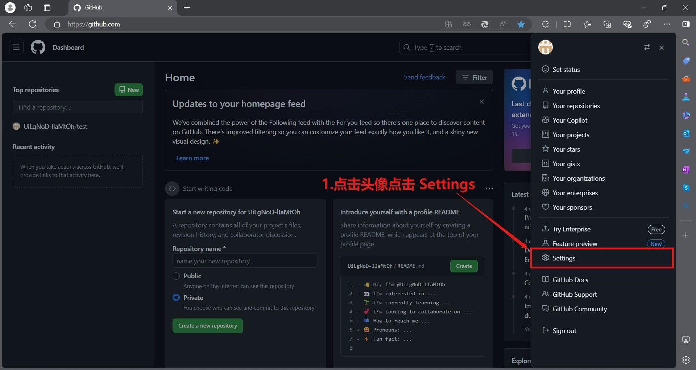

# 欢迎来到我的 GitHub 主页 👋  

## 🐱 普通的描述

github 的账号被封了，应该是大量的 fork 导致的，哎好痛苦，2024/09/20 01:46:19 所有代码才算是在 gitlab 完成提交以后该怎么办呢？代码云存储也不再可靠了，😔  
请大家不要 fork 我的项目，你可以自己复制过去自己默默使用，我好想哭  

emo  

> 能力越大责任越大，能力越小责任越小，没有能力没有责任  
> "Greater power comes with greater responsibility; lesser power comes with lesser responsibility. No power means no responsibility."

> 终有一天，我会衰老忘记一切，过着痛苦失去尊严的日子，即使现在的我也没有尊严可言，我畏惧死亡，也期待死亡，哪怕只有一瞬间，也想趁着还没有衰老还没有丧失自我意识时剥离这一生  
> One day, I will grow old and forget everything, living a painful life stripped of dignity, though I have no dignity to speak of even now. I fear death, yet I also long for it. Even if only for a moment, I want to end this life while I still haven't grown old, while I still have my consciousness intact.

> 此树那宜此中种，器小安能成大用？愿君移向长林间，他日将来作梁栋。  
> — 王冕，《盆中树》，元朝    
> This tree is not suited to be planted here; how can a small vessel achieve great use? I hope you move it to a vast forest, so it may become a beam or pillar in the future.  
> — Wang Mian, *Tree in a Pot*, Yuan Dynasty

> 故木秀于林，风必摧之；堆出于岸，流必湍之；行高于人，众必非之。  
> — 李康，《运命论》，魏晋朝    
> A tree that stands out in the forest is sure to be destroyed by the wind; a pile that rises above the shore is sure to be eroded by the current; a person whose conduct surpasses others is sure to be criticized by the crowd.  
> — Li Kang, *On Destiny*, Wei-Jin Dynasty

1.为了实现 actions workflow 自动化 docker 构建运行，需要添加 `GITHUB_TOKEN` 环境变量，这个是访问 GitHub API 的令牌，可以在 GitHub 主页，点击个人头像，Settings -> Developer settings -> Personal access tokens -> Tokens (classic) -> Generate new token -> Generate new token (classic) ，设置名字为 GITHUB_TOKEN 接着要配置 环境变量有效时间，勾选环境变量作用域 repo write:packages workflow 和 admin:repo_hook 即可，最后点击Generate token，如图所示

  

2.赋予 actions[bot] 读/写仓库权限，在仓库中点击 Settings -> Actions -> General -> Workflow Permissions -> Read and write permissions -> save，如图所示

3.转到 Actions  

    -> generate animation 并且启动 workflow，实现自动化 Snake 提交进度动图  

## 📊 我的 GitHub 统计

## 🔥 使用的语言

## 🌱 使用的系统

## 🏆 GitHub 奖杯

    
<a href="https://star-history.com/#20241204/20241204&Date">
  <picture>
    <source media="(prefers-color-scheme: dark)" srcset="https://api.star-history.com/svg?repos=20241204/20241204&type=Date&theme=dark" />
    <source media="(prefers-color-scheme: light)" srcset="https://api.star-history.com/svg?repos=20241204/20241204&type=Date" />
    
  </picture>
</a>

## 🌟 项目展示
### 📌 [20241204](https://github.com/20241204/20241204)
修改个人 GitHub 欢迎界面。

 

---

### 📌 [s-h-f-serv00](https://github.com/20241204/s-h-f-serv00)
sing-box + hysteria2 + freebsd 支持在 serv00 上搭建 3 个 hysteria2 节点

 

---

### 📌 [s-c-f-serv00](https://github.com/20241204/s-c-f-serv00)
sing-box + cloudflare + freebsd 支持在 serv00 上搭建 vless(cloudflare) + vmess(cloudflare) + trojan(cloudflare) 3 个节点

 

---

### 📌 [ProxyBridge](https://github.com/20241204/ProxyBridge)
这是借用 actions workflow 产生网络环境并使用 sing-box + cloudflare tunnel (临时 argo) + vmess 共享网络环境并通过 cloudflared tunnel 加速网络数据从而让我访问国际互联网的临时应急方案。

 

---

### 📌 [ProxyScriptMihomo](https://github.com/20241204/ProxyScriptMihomo)
适配各种系统依赖于 Mihomo 的虚拟专网技术通用脚本。

 

---

### 📌 [ProxyScriptSingbox](https://github.com/20241204/ProxyScriptSingbox)
适配各种系统依赖于 sing-box 内核的虚拟专网技术通用脚本。

 

---

### 📌 [docker-arch-test](https://github.com/20241204/docker-arch-test)
使用 docker buildx 命令来创建和推送 list 测试多平台镜像推送一个tag。

 

---

### 📌 [docker-arch-sub-topfreeproxies](https://github.com/20241204/docker-arch-sub-topfreeproxies)
构建特殊的 Ubuntu 镜像运行容器，获取最终配置节点文件，主要用于学习提升技术。

 

---

### 📌 [docker-arch-resilio-sync](https://github.com/20241204/docker-arch-resilio-sync)
构建特殊的 Ubuntu 镜像运行容器，获取最终配置节点文件，主要用于学习提升技术。

 

---

### 📌 [docker-arch-pyenv-jupyter](https://github.com/20241204/docker-arch-pyenv-jupyter)
在 arm64v8 和 amd64 上使用的 pyenv Jupyter docker构建材料。

 

---

### 📌 [docker-arch-miniforge-jupyter](https://github.com/20241204/docker-arch-miniforge-jupyter)
在 arm64v8 和 amd64 ubuntu上使用的 miniforge Jupyter docker构建材料

 

---

### 📌 [docker-arch-samba](https://github.com/20241204/docker-arch-samba)
在 arm64v8 和 amd64 alpine 上使用的 samba 构建材料。。

 

---

### 📌 [golearn](https://github.com/20241204/golearn)  
学习 golang 语言之路  

 

---

### 📌 [codetools](https://github.com/20241204/codetools)    
"应急代码小工具"  

 

---

### 📌 [virtual-qemu-raspberry-script](https://github.com/20241204/virtual-qemu-raspberry-script)
qemu 虚拟化树莓派 linux shell 脚本

 

---

### 📌 [BeautyFetcher](https://github.com/20241204/BeautyFetcher)
Python脚本获取美女图片下载。

 

---

### 📌 [BossMatchJobHunter](https://github.com/20241204/BossMatchJobHunter)
Boss直聘批量投递脚本，提高找工作效率。

 

---

### 📌 [DivinationMaster](https://github.com/20241204/DivinationMaster)
开发的占卜算卦脚本，用来测吉凶。

 

---

### 📌 [sing-box-freebsd](https://github.com/20241204/sing-box-freebsd)
用于测试自行变异sing-box 的 freebsd 版本。

 

---

### 📌 [frankiejun-tech4life7777-serv00-play](https://github.com/20241204/frankiejun-tech4life7777-serv00-play)
frankiejun 和 tech4life7777 serv00 上的一些应用，包括批量保号、TG消息推送。

 

---
